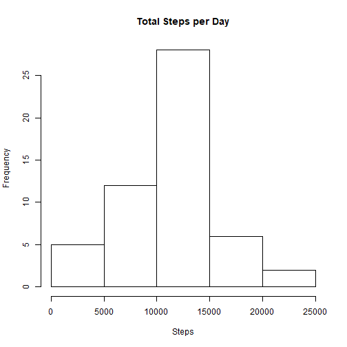
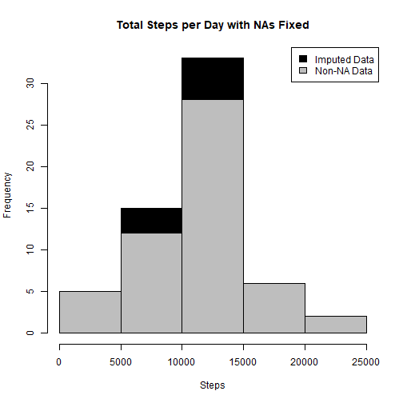
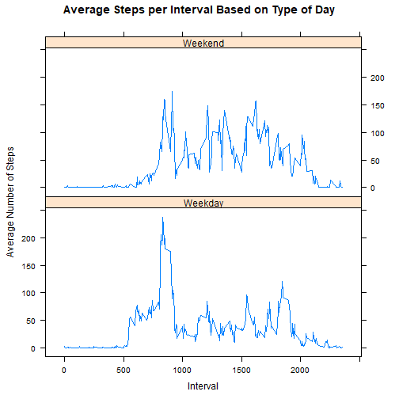

#Introduction/Background on Week 2 Programming Assignment

It is now possible to collect a large amount of data about personal movement using activity monitoring devices such as a Fitbit, Nike Fuelband, or Jawbone Up. These type of devices are part of the "quantified self" movement - a group of enthusiasts who take measurements about themselves regularly to improve their health, to find patterns in their behavior, or because they are tech geeks. But these data remain under-utilized both because the raw data are hard to obtain and there is a lack of statistical methods and software for processing and interpreting the data. 

This assignment makes use of data from a personal activity monitoring device. This device collects data at 5 minute intervals through out the day. The data consists of two months of data from an anonymous individual collected during the months of October and November, 2012 and include the number of steps taken in 5 minute intervals each day.

#What the assignment needs to do:
- Code for reading in the dataset and/or processing the data
- Histogram of the total number of steps taken each day
- Mean and median number of steps taken each day
- Time series plot of the average number of steps taken
- The 5-minute interval that, on average, contains the maximum number of steps
- Code to describe and show a strategy for imputing missing data
- Histogram of the total number of steps taken each day after missing values are imputed
- Panel plot comparing the average number of steps taken per 5-minute interval across weekdays and weekends
- All of the R code needed to reproduce the results (numbers, plots, etc.) in the report


##Part 0 - load libraries

```r
#load required libraries
library(ggplot2)
library(plyr)
library(lattice)
```
##Part 1 - load and transform required data

```r
#Initial data grab
act <- read.csv("c://prog/activity.csv")

#split out days and time for later graphing and aggregation
act$day <- weekdays(as.Date(act$date))
act$DateTime<- as.POSIXct(act$date, format="%Y-%m-%d")
```

##Part 2 - Histogram of steps taken each day

```r
#steps with NA removed
CleanSteps <- act[!is.na(act$steps),]

#summary table by day
SumbyDay <- aggregate(act$steps ~ act$date, FUN = "sum" )
colnames(SumbyDay) <- c("Date", "Steps")

#histogram of steps taken each day
hist(SumbyDay$Steps, breaks=5, xlab="Steps", main = "Total Steps per Day")
```



##Part 3 - Report the mean and median # of steps per day
Question: What is mean total number of steps taken per day?


```r
mean_steps <- as.integer(mean(SumbyDay$Steps))
median_steps <- as.integer(median(SumbyDay$Steps))
```

Answer: The mean number of steps per day is:

```r
mean_steps
```

```
## [1] 10766
```

Answer: The median number of steps per day is:

```r
median_steps
```

```
## [1] 10765
```

##Part 4 - Time series plot of average num of steps taken
Question: What is the average daily activity pattern?


```r
intervalTable <- ddply(CleanSteps, .(interval), summarize, Avg = mean(steps))
# Create the plot
p <- ggplot(intervalTable, aes(x=interval, y=Avg), xlab = "Interval", ylab="Average Number of Steps")
p + geom_line()+xlab("Interval")+ylab("Average Number of Steps")+ggtitle("Average Number of Steps per Interval")
```


Answer: The plot depicts the daily activity pattern. 

##Part 5 - The 5 minute interval with the max avg steps
Question: What is the interval with the max average steps?


```r
maxSteps <- max(intervalTable$Avg)

##Which interval
intervalTable[intervalTable$Avg==maxSteps,1]
```

```
## [1] 835
```

Answer: Maxsteps = 206 at interval 835

##Part 6 - Code to describe and show a strategy for imputing missing data
Strategy: Use interval average by weekday as the substitution value for the missing values

Question: How many values are missing?

```r
#Anwer: the number of missing values in the dataset is:
nrow(act[is.na(act$steps),])
```

```
## [1] 2304
```

```r
## Compute and store the average number of steps per weekday and interval
AvgSteps <- ddply(CleanSteps, .(interval, day), summarize, Avg = mean(steps))

## Create dataset with all NAs for substitution
NAs<- act[is.na(act$steps),]

## Merge NA data with average weekday interval for substitution
MergedData<-merge(NAs, AvgSteps, by=c("interval", "day"))

MergedData_2<- MergedData[,c(6,4,1,2,5)]
colnames(MergedData_2)<- c("steps", "date", "interval", "day", "DateTime")
##Merge the NA averages and non NA data together
MergedSteps <- rbind(CleanSteps, MergedData_2)
```

##Part 7 - Histogram of the total number of steps taken each day after missing values are imputed
Question: Does filling in the NA modify the characteristics of the plot?


```r
##Create sum of steps per date to compare with step 1
SumbyDay2 <- aggregate(MergedSteps$steps ~ MergedSteps$date, FUN= "sum" )
colnames(SumbyDay2)<- c("Date", "Steps")

## Mean of Steps 
as.integer(mean(SumbyDay2$Steps))
```

```
## [1] 10821
```

```r
## Median
as.integer(median(SumbyDay2$Steps))
```

```
## [1] 11015
```

```r
## Creating the histogram of total steps per day

hist(SumbyDay2$Steps, breaks=5, xlab="Steps", main = "Total Steps per Day with NAs Fixed", col="Black")

hist(SumbyDay$Steps, breaks=5, xlab="Steps", main = "Total Steps per Day with NAs Fixed", col="Grey", add=T)

legend("topright", c("Imputed Data", "Non-NA Data"), fill=c("black", "grey") )
```



Answer: The imputed values modify the average data but do not materially change the composition of the plot.

##Part 8 - Panel plot comparing the average number of steps taken per 5-minute interval across weekdays and weekends

Question: Are there differences in activity patterns between weekdays and weekends?


```r
## Create new category based on the days of the week
MergedSteps$DayCategory <- ifelse(MergedSteps$day %in% c("Saturday", "Sunday"), "Weekend", "Weekday")

## Summarize data by interval and type of day
intervalTable2 <- ddply(MergedSteps, .(interval, DayCategory), summarize, Avg = mean(steps))

##Plot data in a panel plot
xyplot(Avg~interval|DayCategory, data=intervalTable2, type="l",  layout = c(1,2),
       main="Average Steps per Interval Based on Type of Day", 
       ylab="Average Number of Steps", xlab="Interval")
```



Answer: There are differences between weekdays and weekends. People likely have more activity time on the weekend.
